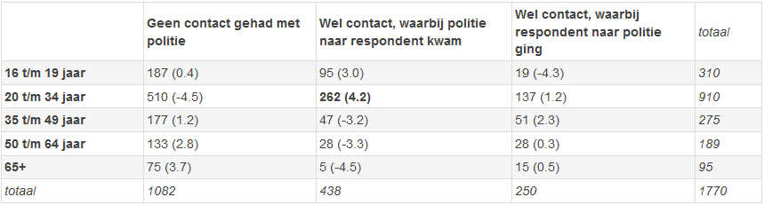

```{r, echo = FALSE, results = "hide"}
include_supplement("1641292970572.png")
```

Question
========
De volgende vragen gaan over de gegevens van 1770 mensen (N=1770) die op
straat ondervraagd zijn over hun contact en ervaringen met de politie.
Deze gegevens zijn afkomstig van een grootschalig onderzoek onder de
Amsterdamse bevolking dat werd opgezet door Anne Wester (Talentenlab) en
Jair Schalkwijk (Controle Alt Delete).  
  
De survey bevatte onder andere de vraag of iemand gedurende de afgelopen
12 maanden wel eens contact heeft gehad met de politie (ja of nee).
Indien iemand aangaf contact te hebben gehad, werd de vervolgvraag
gesteld hoe het laatste contact tot stand kwam: kwam de politie naar de
respondent, of ging de respondent zelf naar de politie toe?  
  
Respondenten beantwoordden ook een vraag over hun leeftijd. Op basis
hiervan heeft de onderzoeker de respondenten ingedeeld in vijf
leeftijdscategorieën.  
  
Op basis van bovengenoemde twee variabelen wil de onderzoeker nagaan of
er een verband bestaat tussen leeftijd en contact met de politie. De
gegevens hierover staan in Tabel 1.  
  
Bekijk de cel met de respondenten in de leeftijdscategorie van 20 t/m 34
jaar die het afgelopen jaar contact hebben gehad met de politie, waarbij
de politie tijdens het laatste contact naar de respondent kwam (262
respondenten). Het gestandaardiseerde residu van deze cel is 4,2. Hoe
moeten we dit getal interpreteren?  
  
**Tabel 1**: De samenhang tussen leeftijd en contact met politie.
Geobserveerde aantallen, met gestandaardiseerd residu (*standardized
residual*) tussen haakjes.  


Answerlist
----------
* Er zijn **meer **respondenten in deze cel dan je zou verwachten als er
  *geen* enkele samenhang zou zijn tussen leeftijd en contact met
  politie.  
  Dit verschil is significant (indien we een significantieniveau van 5%
  hanteren), want de waarde 4,2 is groter dan 1,96.
* Er zijn **minder** respondenten in deze cel dan je zou verwachten als er
  *geen* enkele samenhang zou zijn tussen leeftijd en contact met
  politie.  
  Dit verschil is significant (indien we een significantieniveau van 5%
  hanteren), want de waarde 4,2 is groter dan 1,96.
* Er zijn **meer **respondenten in deze cel dan je zou verwachten als er
  *geen* enkele samenhang zou zijn tussen leeftijd en contact met
  politie.  
  Dit verschil is echter **niet** significant (indien we een
  significantieniveau van 5% hanteren), want de waarde 4,2 is groter dan
  1,96.
* Er zijn **minder** respondenten in deze cel dan je zou verwachten als er
  *geen* enkele samenhang zou zijn tussen leeftijd en contact met
  politie.  
  Dit verschil is echter **niet** significant (indien we een
  significantieniveau van 5% hanteren), want de waarde 4,2 is groter dan
  1,96.

Solution
========


Default value
Answerlist
----------
* True
* False
* False
* False

Meta-information
================
exname: vufsw-chisquared-0064-nl
extype: schoice
exsolution: 1000
exshuffle: TRUE
exsection: inferential statistics/nhst/test statistic/chi-squared
exextra[Type]: interpretation output
exextra[Program]: NA
exextra[Language]: dutch
exextra[Level]: statistical reasoning

