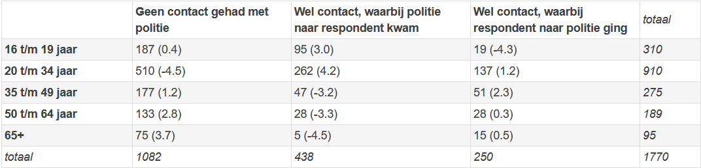

```{r, echo = FALSE, results = "hide"}
include_supplement("1641893103260.png", recursive = TRUE)
```

Question
========
The researcher wants to examine whether there is a relationship between age and contact with the police. The data on this is shown in Table 1 (at the bottom the question).  
H<sub>0</sub>: Age category and contact with police are independent.  
H<sub>a</sub>: Age category and contact with police are dependent.  
  
The researcher calculates the Chi-squared statistic. This turns out to be **70.18**.  
  
What is your conclusion regarding the null hypothesis? Test with alpha = .05.  
  
Table 1: The association between age and contact with police. Observed numbers, with standardized residual (*standardized residual*) in parentheses.  


Answerlist
----------
* We can reject the null hypothesis **well** because the observed Chi-squared statistic is **smaller** than the critical Chi-squared.
* We can **not** reject the null hypothesis because the observed Chi-squared statistic is **smaller** than the critical Chi-squared.
* We can **not** reject the null hypothesis because the observed Chi-squared statistic is **greater** than the critical Chi-squared.
* We can reject the null hypothesis **well** because the observed Chi-squared statistic is **greater** than the critical Chi-squared.

Solution
========

Language Dutch

Levels of Difficulty Easy

M&T Basics of quantitative research Basics of quantitative research  Default value
Answerlist
----------
* False
* False
* False
* True

Meta-information
================
exname: vufsw-chisquared-0089-en
extype: schoice
exsolution: 0001
exshuffle: TRUE
exsection: inferential statistics/nhst/test statistic/chi-squared
exextra[ID]: f2d28
exextra[Type]: interpretating output
exextra[Program]: NA
exextra[Language]: English
exextra[Level]: statistical thinking

