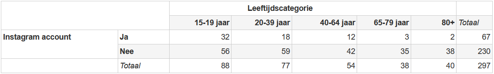

```{r, echo = FALSE, results = "hide"}
include_supplement("1641898922841.png", recursive = TRUE)
```

Question
========
A student at the VU has conducted research on the use of social media among Dutch people. For her thesis, she collected data on the use of Instagram of 297 people. In the following table, the age range of the respondents is plotted according to the question of whether they have an Instagram account (actual observed numbers).  
  
TRUE is the critical Chi-square value when we test whether there is a relationship between these two variables and use an alpha of 5% (α = 0,05)?  
  


Answerlist
----------
* 18.31
* 9.49
* 5.99
* 13.28
* 3.84
* 124.3

Solution
========

Answerlist
----------
* False
* True
* False
* False
* False
* False

Meta-information
================
exname: vufsw-chisquared-0092-en
extype: schoice
exsolution: 010000
exshuffle: TRUE
exsection: inferential statistics/nhst/test statistic/chi-squared
exextra[ID]: f6bf3
exextra[Type]: performing analysis
exextra[Program]: calculator
exextra[Language]: English
exextra[Level]: statistical literacy

