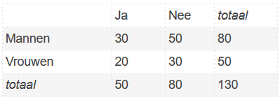

```{r, echo = FALSE, results = "hide"}
include_supplement("1641901241116.png", recursive = TRUE)
```

Question
========
A researcher did not get an answer from everyone an answer. The table below shows how many people he did or did not receive an answer from.  
H<sub>0</sub>: Gender and answer are independent.  
H<sub>a</sub>: Gender and answer are dependent.  
  
What is your conclusion regarding the null hypothesis? Test with alpha = .05.  
  


Answerlist
----------
* We cannot reject the null hypothesis because the p-value is greater than .05.
* We cannot reject the null hypothesis because the p-value is smaller than .05.
* We can reject the null hypothesis because the observed chi-square is greater than .05.
* We can reject the null hypothesis because the observed chi-square is smaller than .05.

Solution
========

Answerlist
----------
* True
* False
* False
* False

Meta-information
================
exname: vufsw-chisquared-0099-en
extype: schoice
exsolution: 1000
exshuffle: TRUE
exsection: inferential statistics/nhst/test statistic/chi-squared
exextra[ID]: 28028
exextra[Type]: performing analysis
exextra[Program]: calculator
exextra[Language]: English
exextra[Level]: statistical literacy

