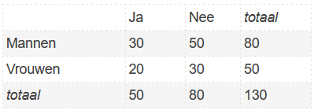

```{r, echo = FALSE, results = "hide"}
include_supplement("1641901241116.png")
```

Question
========
Een onderzoeker heeft bij een bepaalde vraag in zijn survey niet van
iedereen een antwoord gekregen. In onderstaande tabel staat van hoeveel
mensen hij al dan niet een antwoord heeft gekregen.  
H<sub>0</sub>: Geslacht en antwoord zijn onafhankelijk.  
H<sub>a</sub>: Geslacht en antwoord zijn afhankelijk.  
  
Wat is je conclusie wat betreft de nulhypothese? Toets met alpha =
.05.  
  


Answerlist
----------
* We kunnen de nulhypothese niet verwerpen, omdat de p-waarde groter is
  dan .05.
* We kunnen de nulhypothese niet verwerpen, omdat de p-waarde kleiner is
  dan .05.
* We kunnen de nulhypothese verwerpen, omdat de geobserveerde chi-square
  groter is dan .05.
* We kunnen de nulhypothese verwerpen, omdat de geobserveerde chi-square
  kleiner is dan .05.

Solution
========


Answerlist
----------
* True
* False
* False
* False

Meta-information
================
exname: vufsw-chisquared-0099-nl
extype: schoice
exsolution: 1000
exshuffle: TRUE
exsection: inferential statistics/nhst/test statistic/chi-squared
exextra[Type]: performing analysis
exextra[Program]: calculator
exextra[Language]: Dutch
exextra[Level]: statistical literacy

