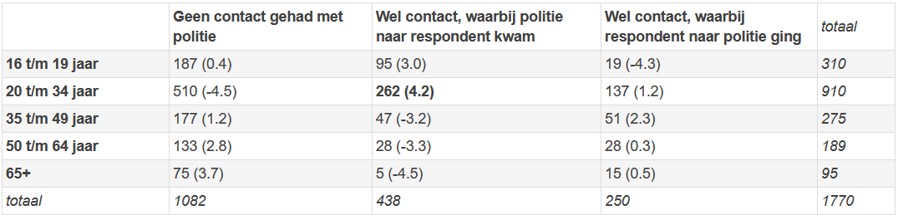

```{r, echo = FALSE, results = "hide"}
include_supplement("1643016226841.png", recursive = TRUE)
```

Question
========
The following questions involve data from 1,770 people (N=1770) who were interviewed on street were interviewed about their contact and experiences with the police. These data come from a large-scale survey among the Amsterdam population that was set up by Anne Wester (Talentenlab) and Jair Schalkwijk (Control Alt Delete). FSW students took part in the "Methodology of Social Science Research" course in 2019 a very important contribution to the conduct of this research by conducting the street surveys.  
  
The survey included the question of whether, during the past 12 months had ever had contact with the police (yes or no). If someone indicated having had contact, the follow-up question was asked how the last contact occurred: did the police come to the respondent, or did the respondent go to the police themselves?  
  
Respondents also answered a question about their age. Based on this, the researcher divided the respondents into five age categories.  
  
Based on the above two variables, the researcher wanted to examine whether there is a relationship between age and contact with the police. The data on this are shown in Table 1.  Look at the cell containing the respondents in the age range of 20 to 34 years who had contact with the police in the past year, with the police came to the respondent during the last contact (262 respondents). The standardized residual of this cell is 4.2. How should we interpret this number?  
  
Table 1: The relationship between age and contact with police. Observed numbers, with standardized residual (*standardized residual*) in parentheses.  


Answerlist
----------
* There are more respondents in this cell than you would expect if there were *no* correlation between age and contact with police.  
  This difference is significant (if we use a significance level of 5% TRUE), because the value 4.2 is greater than 1.96.
* There are fewer respondents in this cell than you would expect if there were *no* correlation between age and contact with police.  
  This difference is significant (if we use a significance level of 5% TRUE), because the value 4.2 is greater than 1.96.
* There are more respondents in this cell than you would expect if there were *no* correlation between age and contact with police.  
  However, this difference is not significant (if we use a significance level of 5%), because the value 4.2 is greater than 1,96.
* There are fewer respondents in this cell than you would expect if there were *no* correlation between age and contact with police.  
  However, this difference is not significant (if we use a significance level of 5%), because the value 4.2 is greater than 1,96.

Solution
========

Answerlist
----------
* True
* False
* False
* False

Meta-information
================
exname: vufsw-chisquared-0112-en
extype: schoice
exsolution: 1000
exshuffle: TRUE
exsection: inferential statistics/nhst/test statistic/chi-squared
exextra[Type]: interpretating ouput
exextra[Program]: NA
exextra[Language]: English
exextra[Level]: statistical reasoning

