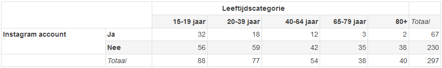

```{r, echo = FALSE, results = "hide"}
include_supplement("1641291849357.png")
```

Question
========
Een student aan de VU heeft onderzoek gedaan naar het gebruik van
sociale media onder Nederlanders. Voor haar thesis verzamelde zij
gegevens over het gebruik van Instagram van 297 mensen. In de  tabel
onderaan de vraag wordt de leeftijdscategorie van de respondenten
uitgezet naar de vraag of ze een Instagram account hebben (feitelijk
geobserveerde aantallen).  
  
Wat is de verwachte waarde (“expected count”) van het aantal mensen dat
tot de jongste leeftijdscategorie behoort (15-19 jaar) dat een Instagram
account heeft bij onafhankelijkheid van de twee variabelen, op basis van
de gegevens in deze tabel? (Rond af op twee decimalen)  
  


Answerlist
----------
* 19,85
* 44,00
* 33,50
* 15,09
* 30,20
* 10,14

Solution
========


Answerlist
----------
* True
* False
* False
* False
* False
* False

Meta-information
================
exname: vufsw-chisquaredforindependence-0045-nl
extype: schoice
exsolution: 100000
exshuffle: TRUE
exsection: inferential statistics/parametric techniques/cross tables/chi-squared for independence
exextra[Type]: calculation
exextra[Program]: calculator
exextra[Language]: dutch
exextra[Level]: statistical literacy

