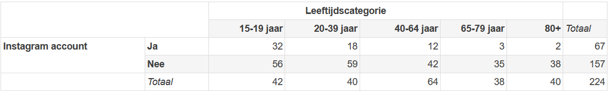

```{r, echo = FALSE, results = "hide"}
include_supplement("1643024901545.png", recursive = TRUE)
```

Question
========
Een student aan de VU heeft onderzoek gedaan naar het gebruik van
sociale media onder Nederlanders. Voor haar thesis verzamelde zij
gegevens over het gebruik van Instagram van 224 mensen. In de  tabel
(onderaan de vraag) wordt de leeftijdscategorie van de respondenten
uitgezet naar de vraag of ze een Instagram account hebben (feitelijk
geobserveerde aantallen).  
  
Wat is de verwachte waarde (“expected count”) van het aantal mensen van
80 jaar of ouder (80+) dat een Instagram account heeft bij
onafhankelijkheid van de twee variabelen, op basis van de gegevens in
deze tabel?   
  


Answerlist
----------
* 11,96
* 17,86
* 20,00
* 13,40
* 44,80
* 2,99

Solution
========


Answerlist
----------
* True
* False
* False
* False
* False
* False

Meta-information
================
exname: vufsw-chisquaredforindependence-0168-nl
extype: schoice
exsolution: 100000
exshuffle: TRUE
exsection: inferential statistics/parametric techniques/cross tables/chi-squared for independence
exextra[Type]: calculation
exextra[Program]: calculator
exextra[Language]: Dutch
exextra[Level]: statistical thinking

