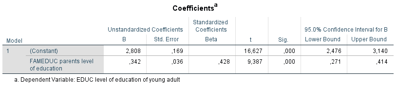

```{r, echo = FALSE, results = "hide"}
include_supplement("1606293471454.png", recursive = TRUE)
include_supplement("1606293416277.png", recursive = TRUE)
```

Question
========
The analyses below were conducted on data from a sample of young adults between the ages of 20 and 40 who were surveyed via a questionnaire about their cultural preferences. The research questions are (1) To what extent the preference for cultural vacations (variable: CULVAC (scale 0-1): a higher score means the preference for cultural vacations is stronger) is caused by the social position of the parental environment (measured is parental education (variable: FAMEDUC (scale 0-7), ranging from primary education (0) to university (7)) a higher score means higher education) and (2) whether this relationship can be explained by one's own achieved education level (variable: EDUC (scale 0-6), ranging from lower vocational education (0) to university (6)) a higher score means a higher education).  
  
Below are the results of two regression analyses.  
  
Regression analysis 1:  
  

  
  
Regression analysis 2:  
  

  
If this sample is one of 95% containing the population value then we can conclude from the 95% confidence interval of 'FAMEDUC' in **model 1 of the first regression analysis **conclude that under this assumption ....

Answerlist
----------
* The population value can also be 0, and that therefore there is insufficient evidence that there will be a positive effect of 'FAMEDUC' in the population
* The population value will not be 0, and therefore there is likely to be a positive effect of 'FAMEDUC' in the population
* The estimated b (.031) is part of the confidence interval, and That there is therefore likely to be a positive effect of 'FAMEDUC' in the population
* The t value 4.785 is outside the limits of the confidence interval lies, and that therefore there is likely to be a positive effect of 'FAMEDUC' in the population will be

Solution
========

Answerlist
----------
* False
* True
* False
* False

Meta-information
================
exname: vufsw-confidence interval-1310-en
extype: schoice
exsolution: 0100
exshuffle: TRUE
exsection: inferential statistics/regression/confidence interval
exextra[ID]: 4b010
exextra[Type]: interpreting output
exextra[Program]: NA
exextra[Language]: English
exextra[Level]: statistical literacy

