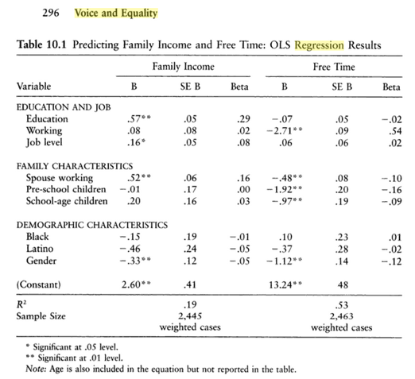

```{r, echo = FALSE, results = "hide"}
include_supplement("1616080027386.png", recursive = TRUE)
```

Question
========
Below is a table showing the results of a regression analysis, taken from the book "*Voice and Equality*" by Verba et al. (1995).  
  
Based on this table, calculate the 95% confidence interval of the effect of "Education" on "Family Income." (Household Income).   
  


Answerlist
----------
* \[0,47; 0,67\]
* \[0,52; 0,62\]
* \[0,36; 0,78\]
* \[0,15; 0,99\]

Solution
========

Answerlist
----------
* True
* False
* False
* False

Meta-information
================
exname: vufsw-confidenceinterval-0066-en
extype: schoice
exsolution: 1000
exshuffle: TRUE
exsection: inferential statistics/regression/confidence interval
exextra[ID]: 54529
exextra[Type]: calculation
exextra[Program]: calculator
exextra[Language]: English
exextra[Level]: statistical literacy

