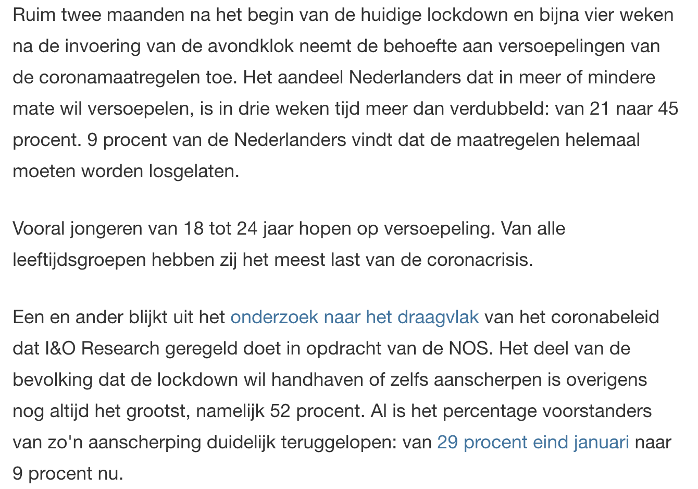

```{r, echo = FALSE, results = "hide"}
include_supplement("Screen__Shot__2021-02-27__at__22.35.49.png", recursive = TRUE)
include_supplement("Screen__Shot__2021-02-27__at__22.36.32.png", recursive = TRUE)
include_supplement("Screen__Shot__2021-02-27__at__22.32.01.png", recursive = TRUE)
```

Question
========
A survey among a representative sample of 2141 Dutch people (n=2141) by I&O Research into the support for the corona policy shows that 45% of respondents want the measures to be be relaxed (see news item on this below).  
  
Based on this sample, what is the 95% confidence interval of the proportion of Dutch people who want the measures relaxed?  
  
(*source*: nos.nl, Feb. 17, 2021)  




Answerlist
----------
* \[0,42; 0,48\]
* \[0,40; 0,50\]
* \[0,41; 0,49\]
* \[0,43; 0,47\]

Solution
========

Language Dutch

Levels of Difficulty Easy

M&T Basics of quantitative research Basics of quantitative research

M&T BIS Default value
Answerlist
----------
* False
* False
* False
* True

Meta-information
================
exname: vufsw-confidenceintervals-0188-en
extype: schoice
exsolution: 0001
exshuffle: TRUE
exsection: inferential statistics/confidence intervals
exextra[Type]: calculation
exextra[Program]: calculator
exextra[Language]: English
exextra[Level]: statistical thinking

