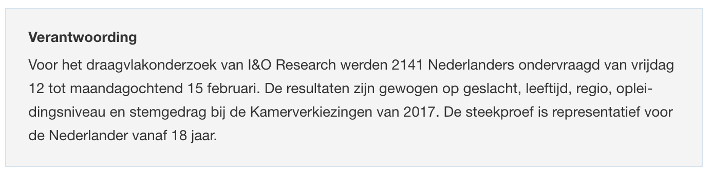

```{r, echo = FALSE, results = "hide"}
include_supplement("Screen__Shot__2021-02-27__at__22.35.49.png")
include_supplement("Screen__Shot__2021-02-27__at__22.36.32.png")
include_supplement("Screen__Shot__2021-02-27__at__22.32.01.png")
```

Question
========
Uit een onderzoek onder een representatieve steekproef van 2141
Nederlanders (n=2141) van I&O Research naar het draagvlak van het
coronabeleid blijkt dat 45% van de respondenten wil dat de maatregelen
versoepeld worden (zie nieuwsbericht hierover hieronder).  
  
Wat is op basis van deze steekproef het 95% betrouwbaarheidsinterval van
het aandeel Nederlanders dat wil dat de maatregelen versoepeld worden?  
  
(*bron*: nos.nl, 17 februari 2021)  
  
  


Answerlist
----------
* \[0,42; 0,48\]
* \[0,40; 0,50\]
* \[0,41; 0,49\]
* \[0,43; 0,47\]

Solution
========


Language  
Nederlands

Levels of Difficulty  
Easy

M&T Basics of quantitative research  
Basics of quantitative research

M&T BIS  
Default value
Answerlist
----------
* False
* False
* False
* True

Meta-information
================
exname: vufsw-confidenceintervals-0188-nl
extype: schoice
exsolution: 0001
exshuffle: TRUE
exsection: inferential statistics/confidence intervals
exextra[Type]: calculation
exextra[Program]: calculator
exextra[Language]: dutch
exextra[Level]: statistical thinking

