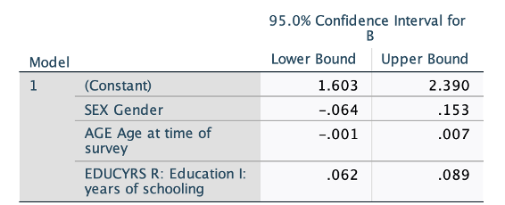

```{r, echo = FALSE, results = "hide"}
include_supplement("1615967815188.png", recursive = TRUE)
```

Question
========
A multiple regression analysis shows the following results. We test two-sided with an alpha of 0.05 (the significance level is 5%). Which effects are significant and how do we know?  
The effect of / the effects of ...   
  


Answerlist
----------
* Gender (SEX) and age (AGE), because the 95% confidence intervals of these variables contain the value 0.
* Gender (SEX) and education (EDUCYRS), because the 95% confidence intervals of these variables contain the value 0.05.
* Education (EDUCYRS), because the 95% confidence interval of this variable does **not** contain the value 0.
* Education (EDUCYRS) and Age (AGE), because the 95% confidence intervals of this variable do **not** contain the value 0.05.

Solution
========

Answerlist
----------
* False
* False
* True
* False

Meta-information
================
exname: vufsw-confidenceintervals-0228-en
extype: schoice
exsolution: 0010
exshuffle: TRUE
exsection: inferential statistics/confidence intervals
exextra[ID]: 14057
exextra[Type]: interpretating output
exextra[Program]: NA
exextra[Language]: English
exextra[Level]: statistical literacy

