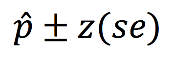

```{r, echo = FALSE, results = "hide"}
include_supplement("Screen__Shot__2020-02-15__at__19.43.05.png")
```

Question
========
This formula is used to estimate the confidence interval of what?  
  


Answerlist
----------
* The population proportion
* The population mean
* The sample mean
* The sample proportion

Solution
========


It is the formula for the population proportion


Answerlist
----------
* True
* False
* False
* False

Meta-information
================
exname: vufsw-confidenceintervals-1178-en
extype: schoice
exsolution: 1000
exshuffle: TRUE
exsection: inferential statistics/confidence intervals
exextra[Type]: conceptual
exextra[Program]: NA
exextra[Language]: english
exextra[Level]: statistical literacy

