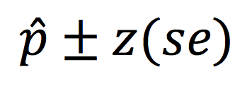

```{r, echo = FALSE, results = "hide"}
include_supplement("Screen__Shot__2020-02-15__at__19.43.05.png", recursive = TRUE)
```

Question
========
Deze formule wordt gebruikt om het betrouwbaarheidsinterval te schatten van wat?  
  


Answerlist
----------
* De verhouding van de populatie
* Het populatiegemiddelde
* Het steekproefgemiddelde
* Het aandeel van de steekproef

Solution
========

Het is de formule voor het bevolkingsaandeel

Answerlist
----------
* Waar
* Onwaar
* Onwaar
* Onwaar

Meta-information
================
exname: vufsw-confidenceintervals-1178-nl
extype: schoice
exsolution: 1000
exshuffle: TRUE
exsection: inferential statistics/confidence intervals
exextra[ID]: 377f8
exextra[Type]: conceptual
exextra[Program]: NA
exextra[Language]: Dutch
exextra[Level]: statistical literacy

