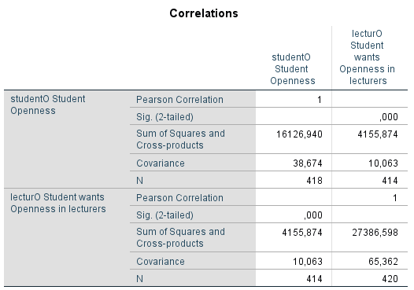

```{r, echo = FALSE, results = "hide"}
include_supplement("1605616634166.png", recursive = TRUE)
include_supplement("1602856133971.png", recursive = TRUE)
```

Question
========


  
In de bovenstaande covariantie/correlatiematrix ontbreekt de correlatie tussen de mate waarin een student hoog scoort op het persoonlijkheidskenmerk 'Openheid' (StudentO: openheid) en de gewenste mate van openheid. persoonlijkheidskenmerk 'Openheid' (StudentO: openheid) en de gewenste mate van openheid bij zijn docenten (DocentO). Het voorbeeld komt uit een onderzoek van Chamorro-Premuzic, beschreven in Field (Discovering statistics using IBM SPSS statistics, 2018) p. 365.  
  
Wat is de correlatie? Geef een getal met twee cijfers achter de komma, niets anders.


Solution
========

Meta-information
================
exname: vufsw-correlation-1294-nl
extype: num
exsolution: 0.2
extol: 0
exsection: descriptive statistics/summary statistics/bivariate statistics/correlation
exextra[Type]: calculation
exextra[Program]: calculator
exextra[Language]: Dutch
exextra[Level]: statistical literacy

