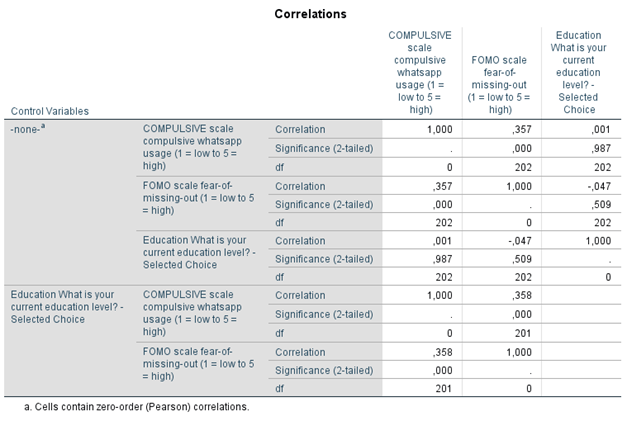

```{r, echo = FALSE, results = "hide"}
include_supplement("1602949639107.png", recursive = TRUE)
```

Question
========
Sommige whatsapp gebruikers kunnen hun whatsapp niet meer met rust laten; voor hen is het dwangmatig gedrag geworden. Dit heeft mogelijk te maken met het gevoel niets te willen missen, of de 'fear-of-missing-out' (FOMO). (FOMO). Het databestand van Esam, Groot, Smits en Verhelst (2016) is verzameld om deze relatie te onderzoeken. De data werden verzameld via een online enquête onder 204 respondenten.  
  
In de gedeeltelijke correlatiematrix hieronder, inclusief nul-orde correlaties, onderzochten we of er een relatie is tussen dwangmatig Whatsapp-gebruik en 'fear-of-missing-out' en of dit verband relatie verandert wanneer de invloed van opleidingsniveau constant wordt gehouden. De variabelen Y = COMPULSIEF (een hogere score betekent meer dwangmatig Whatsapp-gebruik), X = FOMO (een hogere score betekent een sterker gevoel van 'fear-of-missing-out'), en de derde variabele is EDUCATION (opleidingsniveau: een hogere score betekent een hoger opleiding).  
  

  
Hoe moeten we de correlatie tussen FOMO en Whatsapp-gebruik interpreteren?  
   
1: Hoe hoger het niveau van fear of missing out, hoe dwingender het gebruik van Whatsapp.  
2: Hoe lager het niveau van fear-of-missing-out, hoe minder dwangmatig het gebruik van Whatsapp.

Answerlist
----------
* Stelling 1 is waar.
* Alleen Stelling 2 is waar
* Beide stellingen zijn waar
* Geen van beide stellingen is waar

Solution
========


Answerlist
----------
* Onwaar
* Onwaar
* Waar
* Onwaar

Meta-information
================
exname: vufsw-correlation-1351-nl
extype: schoice
exsolution: 0010
exshuffle: TRUE
exsection: descriptive statistics/summary statistics/bivariate statistics/correlation
exextra[ID]: 990ed
exextra[Type]: interpreting output
exextra[Program]: NA
exextra[Language]: Dutch
