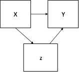

```{r, echo = FALSE, results = "hide"}
include_supplement("1602949639107.png", recursive = TRUE)
include_supplement("1602949826313.png", recursive = TRUE)
include_supplement("1602949868065.png", recursive = TRUE)
include_supplement("1602949886975.png", recursive = TRUE)
include_supplement("1602949911308.png", recursive = TRUE)
```

Question
========
Sommige whatsapp gebruikers kunnen hun whatsapp niet meer met rust laten; voor hen is het dwangmatig gedrag geworden. Dit heeft mogelijk te maken met het gevoel niets te willen missen, of de 'fear-of-missing-out' (FOMO). (FOMO). Het databestand van Esam, Groot, Smits en Verhelst (2016) is verzameld om deze relatie te onderzoeken. De data werden verzameld via een online enquête onder 204 respondenten.  
  
In de gedeeltelijke correlatiematrix hieronder, inclusief nul-orde correlaties, onderzochten we of er een relatie is tussen dwangmatig Whatsapp-gebruik en 'fear-of-missing-out' en of dit verband relatie verandert wanneer de invloed van opleidingsniveau constant wordt gehouden. De variabelen Y = COMPULSIEF (een hogere score betekent meer dwangmatig Whatsapp-gebruik), X = FOMO (een hogere score betekent een sterker gevoel van 'fear-of-missing-out'), en de derde variabele is EDUCATION (opleidingsniveau: een hogere score betekent een hoger opleiding).  
  

Als je de correlaties afrondt op twee cijfers achter de komma, welk causaal model is dan van toepassing op de resultaten van de analyse?

Answerlist
----------
* 
* 
* 
* 

Solution
========

Answerlist
----------
* Waar
* Onwaar
* Onwaar
* Onwaar

Meta-information
================
exname: vufsw-correlation-1352-nl
extype: schoice
exsolution: 1000
exshuffle: TRUE
exsection: descriptive statistics/summary statistics/bivariate statistics/correlation
exextra[Type]: interpreting output
exextra[Program]: NA
exextra[Language]: Dutch
exextra[Level]: statistical thinking

