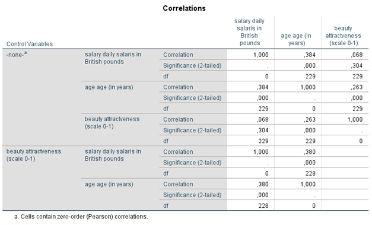
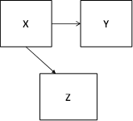
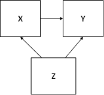
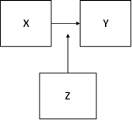
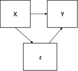

```{r, echo = FALSE, results = "hide"}
include_supplement("1605615806837.png", recursive = TRUE)
include_supplement("1606486140139.png", recursive = TRUE)
include_supplement("1602949868065.png", recursive = TRUE)
include_supplement("1602949886975.png", recursive = TRUE)
include_supplement("1602949911308.png", recursive = TRUE)
```

Question
========
De gedeeltelijke correlatiematrix hieronder, inclusief nul-orde correlaties, onderzocht of er een verband is tussen leeftijd en het salaris van een catwalkmodel en of deze relatie verandert als je de invloed van de aantrekkelijkheid van het model de invloed van de aantrekkelijkheid van het model constant houdt. Y = salaris (in ponden), X = Leeftijd (in jaren), en de derde variabele (Z) is aantrekkelijkheid (Schoonheid: een schaal waarbij een hogere score een hogere aantrekkelijkheid betekent).  

  
Als je de correlaties afrondt op twee cijfers achter de komma, welk causaal model is dan van toepassing op de resultaten van de analyse?

Answerlist
----------
* 
* 
* 
* 

Solution
========

Answerlist
----------
* Waar
* Onwaar
* Onwaar
* Onwaar

Meta-information
================
exname: vufsw-correlations-1296-nl
extype: schoice
exsolution: 1000
exshuffle: TRUE
exsection: inferential statistics/parametric techniques/correlations
exextra[ID]: 1aafd
exextra[Type]: interpreting output
exextra[Program]: NA
exextra[Language]: Dutch
exextra[Level]: statistical literacy

