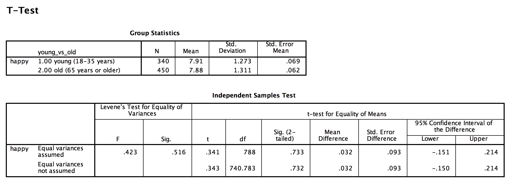

```{r, echo = FALSE, results = "hide"}
include_supplement("Screen__Shot__2019-03-24__at__14.56.10.png", recursive = TRUE)
```

Question
========
Below is the distribution of the happiness level of a random sample of 1919 Dutch people (source: *European Social Survey*, 2016). Respondents were asked the following question: "All things considered, how happy would you say you are?" where the response options ranged between "very unhappy" (0) and "very happy" (10).  
  
We performed a t-test for two means (independent t-test) conducted to test whether there was a significant difference between young people (group 1: 18 to 30 years old) and older people (group 2: 65 years old or older). The results are shown in the output below.  
  
We test two-sided with a significance level of 5% (alpha=0.05).  
  
What is the critical t-value in this test? And in what case would this critical t-value change?  
  


Answerlist
----------
* The critical t-value is 1.96. This critical t-value changes if we were to perform would perform a one-sided test.
* The critical t-value is 1.96. This critical t-value changes if the standard error (SE) of the difference between the two averages would be smaller would be less than 0.05.
* The critical t value is 1.96. This critical t-value changes if the difference between the two averages would be greater than 0.05.
* The critical t-value is 0.34. This critical t-value changes if we were to perform would perform a one-sided test.
* The critical t-value is 0.34. This critical t value changes if the standard error (SE) of the difference between the two averages would be smaller would be less than 0.05.
* The critical t value is 0.34. This critical t-value changes if the difference between the two averages would be greater than 0.05.

Solution
========

Language Dutch
Answerlist
----------
* True
* False
* False
* False
* False
* False

Meta-information
================
exname: vufsw-criticalvalue-0080-en
extype: schoice
exsolution: 100000
exshuffle: TRUE
exsection: inferential statistics/nhst/significance level/critical value
exextra[Type]: conceptual
exextra[Program]: NA
exextra[Language]: English
exextra[Level]: statistical reasoning

