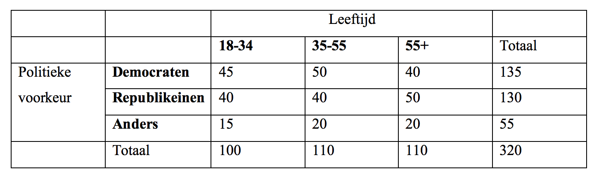

```{r, echo = FALSE, results = "hide"}
include_supplement("Screen__Shot__2019-02-21__at__00.10.07.png")
```

Question
========
Bekijk onderstaande kruistabel met de frequenties van twee
variabelen.   
Wat is de conditionele kans om Democratisch te stemmen, gegeven dat je
in de middelste leeftijdscategorie valt (35-55 jaar)?  
  


Answerlist
----------
* 15,6%
* 37,0%
* 45,5%
* 50,0%
* 42,2%

Solution
========


Language  
Nederlands

M&T Basics of quantitative research  
Basics of quantitative research

M&T BIS  
Default value
Answerlist
----------
* False
* False
* True
* False
* False

Meta-information
================
exname: vufsw-crosstables-0002-nl
extype: schoice
exsolution: 00100
exshuffle: TRUE
exsection: inferential statistics/parametric techniques/cross tables
exextra[Type]: calculation
exextra[Program]: calculator
exextra[Language]: Dutch
exextra[Level]: statistical thinking

