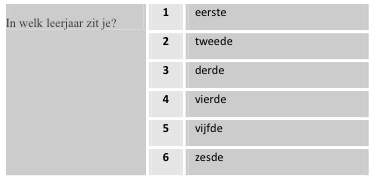

```{r, echo = FALSE, results = "hide"}
include_supplement("Schermafbeelding__2019-01-30__om__14.42.09.png", recursive = TRUE)
```

Question
========
In a survey of cultural participation among school students, the following question was asked.  

  
Suppose you want to do a regression analysis with cultural participation as the dependent variable and these as independent. Is it necessary to make dummies of this variable, and if so, how many to include in the analysis include in the analysis?

Answerlist
----------
* No, it is not necessary, only if you want to investigate nonlinear relationships relationships. It is allowed: you must then include 5 dummy variables
* No, it is not necessary, only if you want to examine nonlinear relationships relationships. It is allowed: you must then include 6 dummy variables.
* Yes, it is necessary because it is a categorical variable: you have to include include 5 dummy variables.
* Yes, it is necessary because it is a categorical variable: you must then then include 6 dummy variables

Solution
========

Answerlist
----------
* True
* False
* False
* False

Meta-information
================
exname: vufsw-dummies-2060-en
extype: schoice
exsolution: 1000
exshuffle: TRUE
exsection: inferential statistics/regression/dummies
exextra[Type]: conceptual
exextra[Program]: NA
exextra[Language]: English
exextra[Level]: statistical thinking

