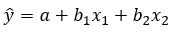

```{r, echo = FALSE, results = "hide"}
include_supplement("multiple__reg__formula__2.jpg", recursive = TRUE)
```

Question
========
Below is the formula of a multiple regression of Y with two independent variables (X<sub>1</sub> and X<sub>2</sub>).  
Suppose you want to know whether **X**<sub>**1** </sub>has a significant influence on Y, controlled for the effect of X<sub>2</sub> on Y ("X<sub>2 </sub>is held constant").  
  
So what should you test in this case? You must then, as an investigator test whether ...  
  


Answerlist
----------
* The value of **b**<sub>**1** </sub>significantly differs from 0
* The difference between the value of **b**<sub>**1** </sub>and the value of **b<sub>**2**</sub>** ****significantly differs from 0
* The difference between the value of **X**<sub>**1** </sub>and the value of **b**<sub>**1**</sub> significantly deviates from 0
* The value of **X**<sub>**1**</sub>significantly differs from 0

Solution
========

it is y = a + b<sub>1</sub> x <sub>1 </sub>+ b<sub>2</sub> x <sub>2</sub>

Answerlist
----------
* True
* False
* False
* False

Meta-information
================
exname: vufsw-equation-0014-en
extype: schoice
exsolution: 1000
exshuffle: TRUE
exsection: inferential statistics/regression/equation
exextra[ID]: 6bdb9
exextra[Type]: conceptual
exextra[Program]: NA
exextra[Language]: English
exextra[Level]: statistical literacy

