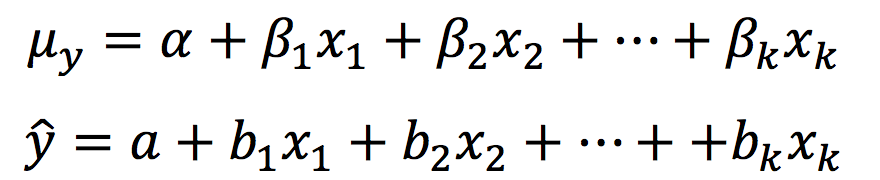

```{r, echo = FALSE, results = "hide"}
include_supplement("Screen__Shot__2019-05-08__at__18.04.06.png", recursive = TRUE)
```

Question
========
On the formula sheet are these two formulas of a multiple regression of Y (see bottom of question).  
What is the difference between "*b*<sub>1</sub>" and<sub> </sub>"*β*<sub>1</sub>" in these formulas?

* **

Answerlist
----------
* "*b*<sub>1</sub>" represents the full effect of X<sub>1</sub> on Y, and "*β*<sub>1</sub>" represents the partial effect of X<sub>1</sub> on Y.
* *b*<sub>1</sub>" represents the direct effect of X<sub>1</sub> on Y, and "*β*<sub>1</sub>" represents the indirect effect of X<sub>1</sub> on Y.
* *b*<sub>1</sub>" represents the observed effect of X<sub>1</sub> on Y in the sample, and "*β*<sub>1</sub>" represents the effect of X<sub>1</sub> on Y in the entire population.
* *b*<sub>1</sub>" represents the uncontrolled effect of X<sub>1</sub> on Y, and "*β*<sub>1</sub>" represents the effect of X<sub>1</sub> on Y after controlling for the effect of the other independent variables.

Solution
========

Answerlist
----------
* False
* False
* True
* False

Meta-information
================
exname: vufsw-equation-0022-en
extype: schoice
exsolution: 0010
exshuffle: TRUE
exsection: inferential statistics/regression/equation
exextra[ID]: 222cb
exextra[Type]: conceptual
exextra[Program]: NA
exextra[Language]: English
exextra[Level]: statistical literacy

