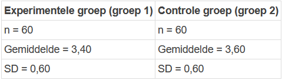

```{r, echo = FALSE, results = "hide"}
include_supplement("1643019976688.png", recursive = TRUE)
```

Question
========
For her Master thesis, a student used an experimental design to
investigate whether test persons who had to read an unfavourable news
item gave a less positive assessment of the image of a certain company
than test persons who had to read a neutral news item. The assessment
was measured on a scale from 1 (very negative) to 5 (very positive).  
  
Transform the data below into a regression equation. The dependent
variable (Y) is the rating of the image ("Rating") and the independent
variable (X) indicates the group ("EXPGROEP= experimentele groep, groep
1"), where the control group ("controle groep, groep 2") is the
reference category (control group = 0; experimental group = 1).  
  
The results show that the mean rating of the two groups is as follows:  
  


Answerlist
----------
* Rating = 3,20 + 0,40 \* EXPGROEP
* Rating = 3,60 – 0,20 \* EXPGROEP
* Rating = 0,20 + 3,40 \* EXPGROEP
* Rating = 3,40 – 3,60 \* EXPGROEP
* Rating = 3,40 – 0,20 \* EXPGROEP
* Rating = 3,60 + 3,40 \* EXPGROEP

Solution
========


Answerlist
----------
* False
* True
* False
* False
* False
* False

Meta-information
================
exname: vufsw-equation-0157-en
extype: schoice
exsolution: 010000
exshuffle: TRUE
exsection: inferential statistics/regression/equation
exextra[ID]: 60091
exextra[Type]: conceptual
exextra[Program]: NA
exextra[Language]: English
exextra[Level]: statistical literacy

