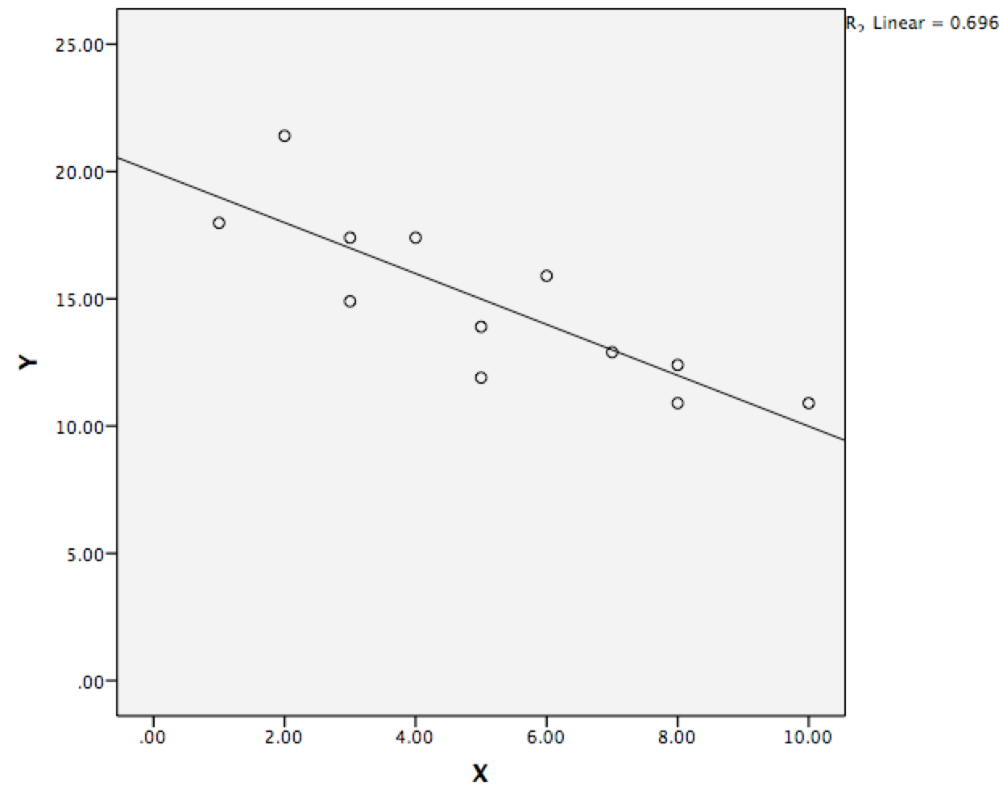

```{r, echo = FALSE, results = "hide"}
include_supplement("Screen__Shot__2019-08-10__at__22.19.05.png", recursive = TRUE)
```

Question
========
Hieronder zie je de illustratie van een regressielijn op basis van van 12 waarnemingen.  
  

  
Wat is (ongeveer) de regressievergelijking op basis van visuele inspectie? vergelijking?

Answerlist
----------
* Y = 20 - 1 \* X
* Y = 20 - 10 \* X
* Y = 20 - 0,5 \* X
* Y = 10 - 2 \* X
* Y = 10 - 20 \* X

Solution
========

Answerlist
----------
* Waar
* Onwaar
* Onwaar
* Onwaar
* Onwaar

Meta-information
================
exname: vufsw-equation-1095-nl
extype: schoice
exsolution: 10000
exshuffle: TRUE
exsection: inferential statistics/regression/equation
exextra[Type]: interpreting graph
exextra[Program]: NA
exextra[Language]: Dutch
exextra[Level]: statistical literacy

