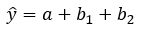
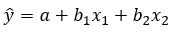
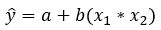
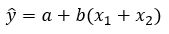

```{r, echo = FALSE, results = "hide"}
include_supplement("multiple__reg__formula__1.jpg", recursive = TRUE)
include_supplement("multiple__reg__formula__2.jpg", recursive = TRUE)
include_supplement("multiple__reg__formula__3.jpg", recursive = TRUE)
include_supplement("multiple__reg__formula__4.jpg", recursive = TRUE)
include_supplement("multiple__reg__formula__2.jpg", recursive = TRUE)
```

Question
========
Noteer de formule van een meervoudig regressiemodel van Y met twee kwantitatieve onafhankelijke variabelen.

Answerlist
----------
* 
* 
* 
* 

Solution
========

Het is 

Answerlist
----------
* Onjuist
* Waar
* Onwaar
* Onwaar

Meta-information
================
exname: vufsw-equation-1236-nl
extype: schoice
exsolution: 0100
exshuffle: TRUE
exsection: inferential statistics/regression/equation
exextra[Type]: conceptual
exextra[Program]: NA
exextra[Language]: Dutch
exextra[Level]: statistical literacy

