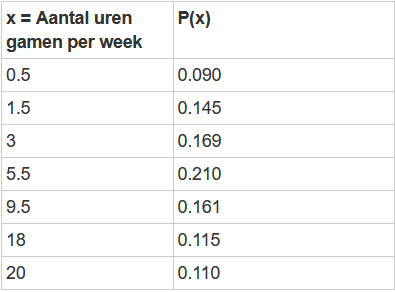

```{r, echo = FALSE, results = "hide"}
include_supplement("1643016977825.png", recursive = TRUE)
```

Question
========
Wanneer wordt onderzocht hoe vaak gamers tussen 18 en 25 jaar videogames spelen, vindt een onderzoeker de resultaten in de onderstaande tabel.  
  
Wat is op basis van deze steekproef de verwachte waarde van het aantal uren per week ("x=aantal uren gamen per wek") dat gamers tussen 18 en 25 jaar videogames spelen? videospellen spelen?   
* Ond af op de dichtstbijzijnde decimaal*.  
  


Antwoordlijst
----------
* 7,7
* 5,5
* Tussen 3,0 en 5,5
* Tussen 9,5 en 18,0

Solution
========

Antwoordlijst
----------
* Waar
* Onwaar
* Onwaar
* Onwaar

Meta-information
================
exname: vufsw-expectedvalue-0118-nl
extype: schoice
exsolution: 1000
exshuffle: TRUE
exsection: probability/elementary probability/random variables/expected value
exextra[Type]: calculation
exextra[Program]: calculator
exextra[Language]: Dutch
exextra[Level]: statistical thinking

