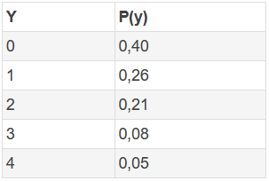

```{r, echo = FALSE, results = "hide"}
include_supplement("1643017364978.png", recursive = TRUE)
```

Question
========
De onderstaande kansverdeling is gegeven. Wat is de verwachte waarde E(y) van deze kansverdeling?  
  


Answerlist
----------
* 0,60
* 1,12
* 2,20
* 0,40
* 2,00
* 0,25

Solution
========

Answerlist
----------
* Onjuist
* Waar
* Onwaar
* Onwaar
* Onwaar
* Onwaar

Meta-information
================
exname: vufsw-expectedvalue-0123-nl
extype: schoice
exsolution: 010000
exshuffle: TRUE
exsection: probability/elementary probability/random variables/expected value
exextra[Type]: calculation
exextra[Program]: calculator
exextra[Language]: Dutch
exextra[Level]: statistical thinking

