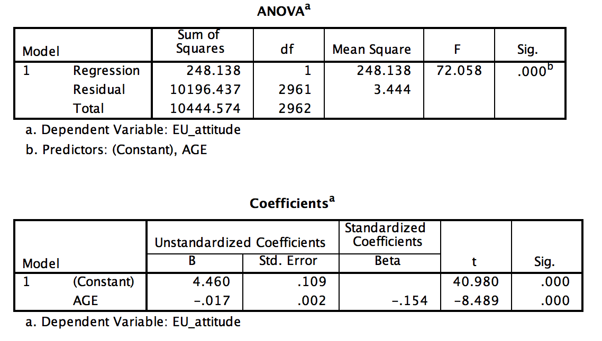

```{r, echo = FALSE, results = "hide"}
include_supplement("Screen__Shot__2019-08-13__at__13.51.34.png")
```

Question
========
Hieronder zijn de resultaten weergeven van een enkelvoudige regressie.
De afhankelijke variabele is houding ten aanzien van de Europese
eenwording, waarbij de schaal loopt van 1 (zeer negatieve houding) t/m 7
(zeer positieve houding). “**AGE**” is leeftijd in jaren. De data is
afkomstig van het Nationaal Kiezersonderzoek 2017.  
Wat is de verklaarde variantie van dit regressie-model? (Rond af op 1
decimaal)   
  


Answerlist
----------
* 2,4%
* 4,7%
* 12,5%
* 0,2%
* 7,2%
* 1,6%

Solution
========


Answerlist
----------
* True
* False
* False
* False
* False
* False

Meta-information
================
exname: vufsw-explainedvariance-0170-nl
extype: schoice
exsolution: 100000
exshuffle: TRUE
exsection: factor analysis/explained variance
exextra[Type]: calculation
exextra[Program]: calculator
exextra[Language]: dutch
exextra[Level]: statistical thinking

