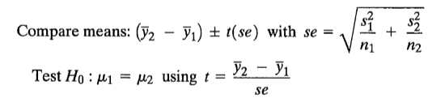

```{r, echo = FALSE, results = "hide"}
include_supplement("compare__means__t.png", recursive = TRUE)
```

Question
========
Is gender gerelateerd aan de evaluatie van politici? Een politiek journalist stelt dat vrouwen over het algemeen positiever zullen zijn over vrouwelijke kandidaten dan mannen. Een Amerikaanse onderzoeker wilde deze hypothese en verzamelde gegevens over de gevoelens van mensen over Sarah Palin in 2008, op een schaal van 0 (zeer negatieve gevoelens) tot 100 (zeer positieve gevoelens). Hieronder staan de resultaten.  
  
  

<tabel> <colgroup> <col style="width: 20%" /> <col style="width: 20%" /> <col style="width: 20%" /> <col style="width: 20%" /> <col style="width: 20%" /> </colgroep> <tbody> <tr class="odd"> <td><br /> </td> <td class="tvcss_2">N </td> <td class="tvcss_3 tvcss_2">mean</td> <td class="tvcss_4 tvcss_2">standaardafwijking </td> <td class="tvcss_2">standaardfout</td> </tr> <tr class="even"> <td>Vrouwen (groep 1) </td> <td>855</td> <td class="tvcss_3">48.53</td> <td class="tvcss_4"> 26,87</td> <td>0,92</td> </tr> <tr class="odd"> <td>Mannen (groep 2)</td> <td>1127</td> <td class="tvcss_3">48.17</td> <td class="tvcss_4"> 27,17</td> <td>0,81</td> </tr> </tbody> </table>

  
  
Wat is de waargenomen t-waarde voor de test van de hypothese?

Antwoordlijst
----------
* 0.29
* 0.39
* 1.53
* 3.96
* 2.05

Solution
========

kun je dit berekenen met:  

  
  
se= √((26,87*26,87)/855 + (27,17*1717/1127))= √(0,844+0,655)=1,224 t= (48,55-48,17)/1,244=0,29

Antwoordlijst
----------
* Waar
* Onwaar
* Onwaar
* Onwaar
* Onwaar

Meta-information
================
exname: vufsw-independent samples means-1162-nl
extype: schoice
exsolution: 10000
exshuffle: TRUE
exsection: inferential statistics/parametric techniques/t-test/independent samples means
exextra[Type]: calculation
exextra[Program]: calculator
exextra[Language]: Dutch
exextra[Level]: statistical literacy

