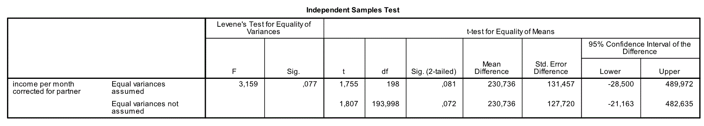

```{r, echo = FALSE, results = "hide"}
include_supplement("Capture.gif", recursive = TRUE)
```

Question
========
Een onderzoeker trekt een willekeurige steekproef van 200 werknemers van een multinational. De vragenlijst die ze invulden bevatte een vraag over het inkomen van de respondent. inkomen van de respondent. De werkgever beweert dat er geen verschil in inkomen mag zijn tussen mannen (groep 1) en vrouwen (groep 2). De onderzoeker verwacht dat vrouwen minder verdienen dan mannen en toetst deze verwachting met α = 0,05. Hieronder staan de resultaten. De analyse houdt rekening met relevante controlevariabelen (niet zichtbaar in de uitvoer).  
   
 
Gebruik voor deze vraag de resultaten van "Gelijke varianties niet aangenomen". De H<sub>0</sub> wordt niet verworpen omdat ...

Answerlist
----------
* P &gt; α.
* De waarde 0 valt binnen het 95% betrouwbaarheidsinterval.
* A en b zijn beide juist.
* Deze conclusie is onjuist. H<sub>0</sub> moet verworpen worden.

Solution
========

Answerlist
----------
* Waar
* Onwaar
* Onwaar
* Onwaar

Meta-information
================
exname: vufsw-independent samples means-1232-nl
extype: schoice
exsolution: 1000
exshuffle: TRUE
exsection: inferential statistics/parametric techniques/t-test/independent samples means
exextra[ID]: 78fc2
exextra[Type]: interpreting output
exextra[Program]: NA
exextra[Language]: Dutch
exextra[Level]: statistical literacy

