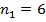

```{r, echo = FALSE, results = "hide"}
include_supplement("image006578cc6dc.gif", recursive = TRUE)
include_supplement("image007578cc6dc.gif", recursive = TRUE)
include_supplement("image008578cc6dc.gif", recursive = TRUE)
include_supplement("image009578cc6dc.gif", recursive = TRUE)
include_supplement("image010578cc6dc.gif", recursive = TRUE)
include_supplement("image011578cc6dc.gif", recursive = TRUE)
include_supplement("1547814124015.png", recursive = TRUE)
```

Question
========
The following (abrived) news message appeared on NU.nl (9 juli 2014).  
  

<table>
<colgroup>
<col style="width: 100%" />
</colgroup>
<tbody>
<tr class="odd">
<td><pre><code>Robben is more often a victim of fouls at the World Cup </code></pre>
<pre><code>Arjen Robben is more often a victim of fouls committed at the World Cup than during the qualifying round of the Dutch squad. 
In the five games that 30-year-old attacker has played in Brazil, 22 times a foul was committed on him. That is an average of 4.4 per match. 
During the six World Cup qualifying matches of Robben, which he played against Romania, Hungary and twice against Estonia and Turkey, the total number of fouls committed on him was only eleven. 
The average with 1.8 fouls per game is therefore much lower. </code></pre>
<br />
</td>
</tr>
</tbody>
</table>

  
A researcher tests the statement in the article about the higher number
of fouls per game committed on Robben at the World Cup. Suppose the
standard deviations are also known.  
These are the data for the World Cup qualifiers:
;
;
.
These are the data for the World Cup matches:
;
;
.
  
Test with alpha= 0,05. Is the number of fouls committed on Robben during
the WC (group 2) significantly higher than during the qualification
matches (group 1)?

Answerlist
----------
* Yes, because the critical t-value is 1.83 and the observed absolute
  t-value is 2.40.
* Yes, because the critical t-value is 1.83 and the observed absolute
  t-value is 2.60.
* Yes, because the critical t-value is 2.26 and the observed absolute
  t-value is 2.40.
* Yes, because the critical t-value is 2.26 and the observed absolute
  t-value is 2.60.

Solution
========


It is significant different because the critical t-value is 1.83 and the
observed absolute t-value is 2.40.  
  
The critical t value can be found in the table (df=11-2=9) in the table.
The absolute t value can be calculated with:  
  
  

  
se=1,083, thus (4,40-1,80)/ 1,083= 2,40.

Answerlist
----------
* True
* False
* False
* False

Meta-information
================
exname: vufsw-independent samples means-1249-en
extype: schoice
exsolution: 1000
exshuffle: TRUE
exsection: inferential statistics/parametric techniques/t-test/independent samples means
exextra[ID]: b173e
exextra[Type]: calculation
exextra[Program]: calculator
exextra[Language]: English
exextra[Level]: statistical literacy

