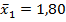
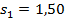
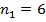
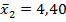
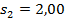
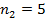
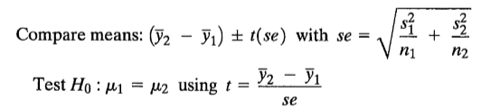

```{r, echo = FALSE, results = "hide"}
include_supplement("image006578cc6dc.gif", recursive = TRUE)
include_supplement("image007578cc6dc.gif", recursive = TRUE)
include_supplement("image008578cc6dc.gif", recursive = TRUE)
include_supplement("image009578cc6dc.gif", recursive = TRUE)
include_supplement("image010578cc6dc.gif", recursive = TRUE)
include_supplement("image011578cc6dc.gif", recursive = TRUE)
include_supplement("1547814124015.png", recursive = TRUE)
```

Question
========
Het volgende (afgekorte) nieuwsbericht verscheen op NU.nl (9 juli 2014).  
  

<tabel> <colgroup> <col style="width: 100%" /> </colgroup> <tbody> <tr class="odd"> <td><pre><code>Robben is vaker slachtoffer van overtredingen op het WK </code></pre> <pre><code>Arjen Robben is op het WK vaker slachtoffer van overtredingen dan tijdens de kwalificatie van Oranje. In de vijf wedstrijden die de 30-jarige aanvaller in Brazilië heeft gespeeld, is er 22 keer een overtreding op hem gemaakt. Dat is een gemiddelde van 4,4 per wedstrijd. Tijdens de zes WK-kwalificatiewedstrijden van Robben, die hij speelde tegen Roemenië, Hongarije en twee keer tegen Estland en Turkije, werden er in totaal slechts elf overtredingen op hem gemaakt. Het gemiddelde met 1,8 overtredingen per wedstrijd is dus veel lager. </code></pre> <br /> </td> </tr> </tbody> </table>

  
Een onderzoeker test de bewering in het artikel over het hogere aantal overtredingen per wedstrijd van Robben op het WK. Stel dat de standaarddeviaties ook bekend zijn.  
Dit zijn de gegevens voor de WK-kwalificatiewedstrijden:
;
;
. Dit zijn de gegevens voor de wereldbekerwedstrijden:
;
;
.  Test met alpha= 0,05. Is het aantal overtredingen op Robben tijdens het WK (groep 2) significant hoger dan tijdens de kwalificatiewedstrijden (groep 1)? wedstrijden (groep 1)?

Answerlist
----------
* Ja, want de kritische t-waarde is 1,83 en de waargenomen absolute t-waarde is 2,40.
* Ja, want de kritische t-waarde is 1,83 en de waargenomen absolute t-waarde 2,60 is.
* Ja, want de kritische t-waarde is 2,26 en de waargenomen absolute t-waarde 2,40 is.
* Ja, want de kritische t-waarde is 2,26 en de waargenomen absolute t-waarde 2,60 is.

Solution
========

Het is significant anders omdat de kritische t-waarde 1,83 is en de waargenomen absolute t-waarde 2,40 is.  
  
De kritische t-waarde kan worden gevonden in de tabel (df=11-2=9) in de tabel. De absolute t-waarde kan worden berekend met:  
  
  

  
se=1,083, dus (4,40-1,80)/ 1,083= 2,40.

Answerlist
----------
* Waar
* Onwaar
* Onwaar
* Onwaar

Meta-information
================
exname: vufsw-independent samples means-1249-nl
extype: schoice
exsolution: 1000
exshuffle: TRUE
exsection: inferential statistics/parametric techniques/t-test/independent samples means
exextra[Type]: calculation
exextra[Program]: calculator
exextra[Language]: Dutch
exextra[Level]: statistical literacy

