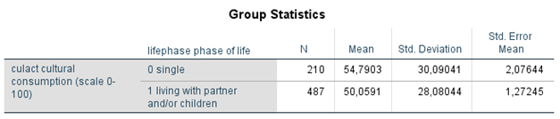
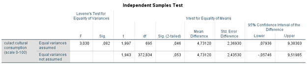

```{r, echo = FALSE, results = "hide"}
include_supplement("1602957481292.png", recursive = TRUE)
include_supplement("1602957504685.png", recursive = TRUE)
```

Question
========

  
In the above analysis of a 2007 Dutch sample, it was examined whether cultural participation between singles and cohabitants (with partner and/or children) differ. The scale for cultural participation (culact: 0-100) runs from low to high.  
  
From the above output we can see that ...

Answerlist
----------
* Singles are on average more culturally active than cohabitants, but that the difference is not significant
* Singles are on average more culturally active than cohabitants and that the difference is significant
* Cohabitants are on average more culturally active than singles, but that the difference is not significant
* Cohabitants are on average more culturally active than singles and that the difference is significant

Solution
========

Answerlist
----------
* False
* True
* False
* False

Meta-information
================
exname: vufsw-independent samples means-1380-en
extype: schoice
exsolution: 0100
exshuffle: TRUE
exsection: inferential statistics/parametric techniques/t-test/independent samples means
exextra[Type]: interpreting output
exextra[Program]: NA
exextra[Language]: English
exextra[Level]: statistical thinking

