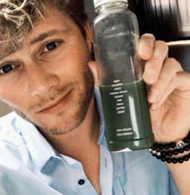
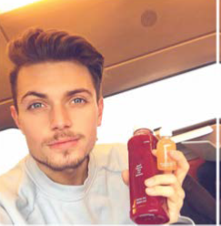
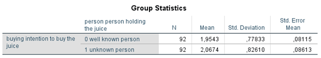
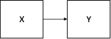
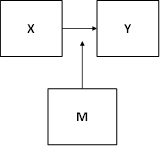
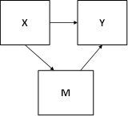

```{r, echo = FALSE, results = "hide"}
include_supplement("1602957985289.png", recursive = TRUE)
include_supplement("1602958004820.png", recursive = TRUE)
include_supplement("1602957955060.png", recursive = TRUE)
include_supplement("1602957967127.png", recursive = TRUE)
include_supplement("1602837664810.png", recursive = TRUE)
include_supplement("1602837678070.png", recursive = TRUE)
include_supplement("1602837695524.png", recursive = TRUE)
include_supplement("1602854063507.png", recursive = TRUE)
```

Question
========
In an experiment on the effect of food marketing on purchase intentions (Laura Sjardin, Josephine Ruijs, Nora Michon and Lianne van der Poel, 2017), 92 respondents were given a photo on Instagram via an online survey of a healthy "juice" (fruit juice). In the photo of one (random) half of the respondents, the juice was shown by a Dutch celebrity (Tim Douwsma, left photo), on that of the other half by an unknown Dutchman (right photo). The respondents had to indicate to what extent they would plan to buy the juice. juice ('buying': a higher score means a higher buying intention). The question was whether showing the juice by a famous Dutchman would lead to a higher buying intention than showing the juice by an unknown Dutch person.  
  


  

  
Which causal model is being tested in this research question?

Answerlist
----------
* 
* 
* 
* 

Solution
========

Answerlist
----------
* True
* False
* False
* False

Meta-information
================
exname: vufsw-independent samples means-1382-en
extype: schoice
exsolution: 1000
exshuffle: TRUE
exsection: inferential statistics/parametric techniques/t-test/independent samples means
exextra[Type]: conceptual
exextra[Program]: NA
exextra[Language]: English
exextra[Level]: statistical literacy

