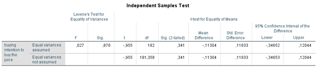

```{r, echo = FALSE, results = "hide"}
include_supplement("1602957985289.png", recursive = TRUE)
include_supplement("1602958004820.png", recursive = TRUE)
include_supplement("1602957955060.png", recursive = TRUE)
include_supplement("1602957967127.png", recursive = TRUE)
```

Question
========
In an experiment on the effect of food marketing on purchase intentions (Laura Sjardin, Josephine Ruijs, Nora Michon and Lianne van der Poel, 2017), 92 respondents were given a photo on Instagram via an online survey of a healthy "juice" (fruit juice). In the photo of one (random) half of the respondents, the juice was shown by a Dutch celebrity (Tim Douwsma, left photo), on that of the other half by an unknown Dutchman (right photo). The respondents had to indicate to what extent they would plan to buy the juice. juice ('buying': a higher score means a higher buying intention). The question was whether showing the juice by a famous Dutchman would lead to a higher buying intention than showing the juice by an unknown Dutch person.  
  


  

  
From the results of the analysis, we can see that...

Answerlist
----------
* The intention to buy the juice is greater when the juice is shown is shown by a known person than when the juice is shown by an unknown person; the difference is not significant
* The intention to buy the juice is greater when the juice is shown shown by a known person than when the juice is shown by an unknown person; the difference is significant
* The intention to buy the juice is lower when the juice is shown by a known person than when the juice is shown by an unknown person; the difference is not significant
* The intention to buy the juice is less when the juice is shown by a known person than when the juice is shown by an unknown person; the difference is significant

Solution
========

Answerlist
----------
* False
* False
* True
* False

Meta-information
================
exname: vufsw-independent samples means-1383-en
extype: schoice
exsolution: 0010
exshuffle: TRUE
exsection: inferential statistics/parametric techniques/t-test/independent samples means
exextra[Type]: interpreting output
exextra[Program]: NA
exextra[Language]: English
exextra[Level]: statistical thinking

