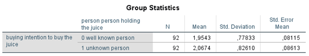

```{r, echo = FALSE, results = "hide"}
include_supplement("1602957985289.png", recursive = TRUE)
include_supplement("1602958004820.png", recursive = TRUE)
include_supplement("1602957955060.png", recursive = TRUE)
include_supplement("1602957967127.png", recursive = TRUE)
```

Question
========
In een experiment over het effect van voedselmarketing op koopintenties
(Laura Sjardin, Josephine Ruijs, Nora Michon en Lianne van der Poel,
2017) kregen 92 respondenten via een online survey een foto op Instagram
van een gezonde ‘juice’ (vruchtensap) te zien. Op de foto van de ene
(random) helft van de respondenten werd de juice getoond door een
bekende Nederlander (Tim Douwsma, linker foto), op die van de andere
helft door een onbekende Nederlander (rechter foto). De respondenten
moesten vervolgens aangeven in hoeverre ze van plan zouden zijn om de
juice te kopen (‘buying’: een hogere score betekent een hogere
koopintentie). De vraag was of het tonen van de juice door een bekende
Nederlander tot een hogere koopintentie zou leiden dan het tonen van de
juice door een onbekende Nederlander.  
  


  

  
Uit de resultaten van de analyse kunnen we opmaken dat...

Answerlist
----------
* De intentie om de juice te kopen groter is wanneer de juice getoond
  wordt door een bekend persoon dan wanneer de juice getoond wordt door
  een onbekend persoon; het verschil is niet significant
* De intentie om de juice te kopen groter is wanneer de juice getoond
  wordt door een bekend persoon dan wanneer de juice getoond wordt door
  een onbekend persoon; het verschil is significant
* De intentie om de juice te kopen minder groot is wanneer de juice
  getoond wordt door een bekend persoon dan wanneer de juice getoond wordt
  door een onbekend persoon; het verschil is niet significant
* De intentie om de juice te kopen minder groot is wanneer de juice
  getoond wordt door een bekend persoon dan wanneer de juice getoond wordt
  door een onbekend persoon; het verschil is significant

Solution
========


Answerlist
----------
* False
* False
* True
* False

Meta-information
================
exname: vufsw-independent samples means-1383-nl
extype: schoice
exsolution: 0010
exshuffle: TRUE
exsection: inferential statistics/parametric techniques/t-test/independent samples means
exextra[ID]: 33c59
exextra[Type]: interpreting output
exextra[Program]: NA
exextra[Language]: Dutch
exextra[Level]: statistical thinking

