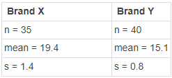

```{r, echo = FALSE, results = "hide"}
include_supplement("1644999332975.png", recursive = TRUE)
```

Question
========
Met twee merken kaarsen (merk X en merk Y) is getest hoeveel hoeveel uur ze meegaan. De resultaten staan hieronder.  
  

  
H<sub>0</sub>: mean1 - mean2 = 0 H<sub>a</sub>: mean1 - mean2 is niet gelijk aan 0  Trek conclusies over de hypothesen met een significantieniveau van .01 (alpha = 1%).

Antwoordenlijst
----------
* We kunnen de nulhypothese verwerpen, omdat de absolute waargenomen t-waarde groter is dan de kritische t-waarde.
* We kunnen de nulhypothese niet verwerpen, omdat de absolute waargenomen t-waarde groter is dan de kritische t-waarde.
* We kunnen de nulhypothese verwerpen, aangezien de absolute waargenomen t-waarde kleiner is dan de kritische t-waarde.
* We kunnen de nulhypothese niet verwerpen, aangezien de absolute waargenomen t-waarde kleiner is dan de kritische t-waarde.

Solution
========

We kunnen de nulhypothese verwerpen, omdat de absolute waargenomen t-waarde groter is dan de kritische t-waarde.  
We kunnen de t-waarde berekenen met:  
  
Vergelijk gemiddelden: (ȳ<sub>2</sub> - ȳ<sub>1</sub>) ± *t*(*se*) met *se* =. sqrt [ (*s*<sub>1</sub><sup>2</sup> / *n*<sub>1</sub>) + (*s*<sub>2</sub><sup>2</sup> / *n<sub>2</sub>*) \]  
Test *H*<sub>0</sub> : *μ*1 = *μ*2 m.b.v. *t* = (ȳ<sub>2</sub> - ȳ<sub>1</sub>) / *se*

Taal Nederlands

Moeilijkheidsniveaus Gemiddeld

M&T BIS Standaardwaarde

M&T Hypothesetest: gemiddelden Standaardwaarde
Antwoordlijst
----------
* Waar
* Onwaar
* Onwaar
* Onwaar

Meta-information
================
exname: vufsw-independentsamplesmeans-1174-nl
extype: schoice
exsolution: 1000
exshuffle: TRUE
exsection: inferential statistics/parametric techniques/t-test/independent samples means
exextra[Type]: performing analysis
exextra[Program]: calculator
exextra[Language]: Dutch
exextra[Level]: statistical thinking

