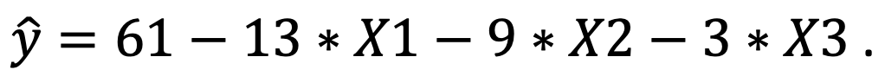

```{r, echo = FALSE, results = "hide"}
include_supplement("Screenshot__2021-03-16__at__15.15.45.png", recursive = TRUE)
```

Question
========
Suppose we conducted a survey and estimated a regression model to examine what factors influence mental health among employees influence. It is predicted that high psychological demands, lack of control over work, and lack of social support at work all reduce mental health.  
  
We measure "mental health" (Y) on a scale of 0-100, where a higher score means better mental health. For the characteristics of the job a person has, we distinguish between "psychological demands" (*X*1), "lack of control" (*X*2) and "lack of of social support" (*X*3). We measure each independent variable on a scale from 0 (low on this characteristic) to 4 (high on this characteristic).  
  
We find the regression equation below.   
  
What is the intercept (the constant) and how should you interpret this number interpret this number?  


Answerlist
----------
* The intercept = 61. This is the predicted mental health if the job of the person scores 0 on psychological demands, 0 scores on lack of control over the job, and 0 scores on lack of social support.
* The intercept = (61-13-9-3=) 36. This is the predicted mental health if the person's job scores 0 on psychological demands, 0 scores on lack of control over the job, and 0 scores on lack of social support.
* The intercept = 61. This is a meaningless number and is only included in the regression equation for mathematical reasons.
* The intercept = (61-13-9-3=) 36. This is a meaningless number and is included in the regression equation only for mathematical reasons.

Solution
========

Answerlist
----------
* True
* False
* False
* False

Meta-information
================
exname: vufsw-intercept-0224-en
extype: schoice
exsolution: 1000
exshuffle: TRUE
exsection: inferential statistics/regression/intercept
exextra[ID]: 04890
exextra[Type]: conceptual
exextra[Program]: NA
exextra[Language]: English
exextra[Level]: statistical literacy

