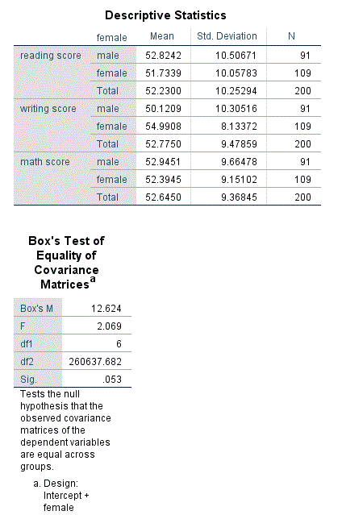
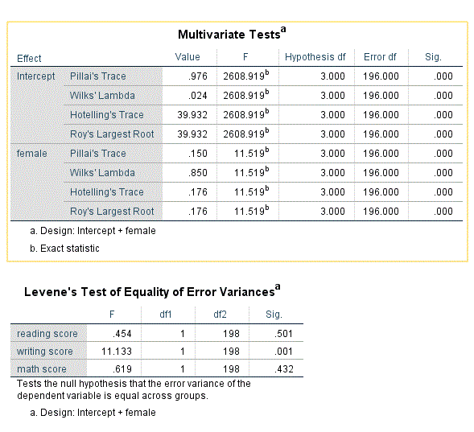
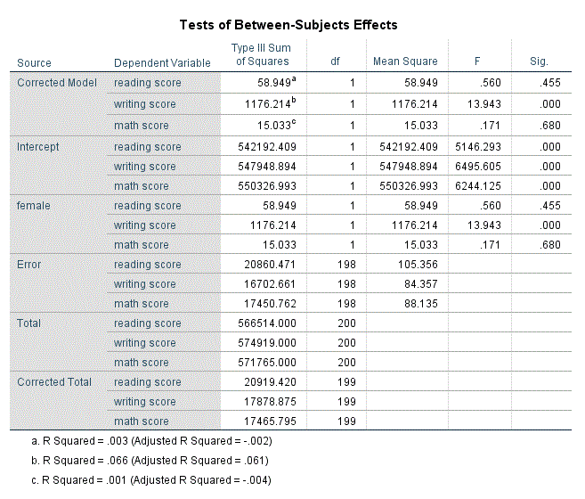
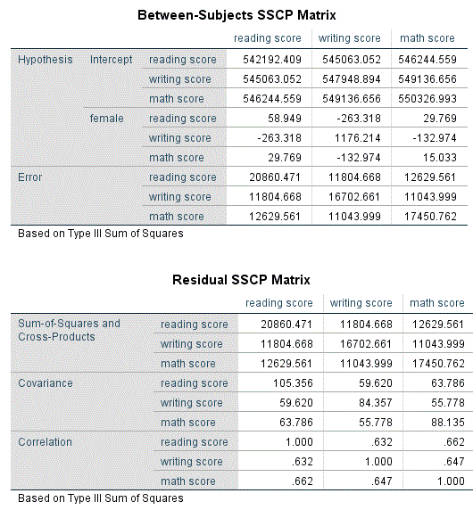

```{r, echo = FALSE, results = "hide"}
include_supplement("Capture2.gif", recursive = TRUE)
include_supplement("Capture3.gif", recursive = TRUE)
include_supplement("Capture4.gif", recursive = TRUE)
include_supplement("Capture5.gif", recursive = TRUE)
include_supplement("Capture2.gif", recursive = TRUE)
include_supplement("Capture3.gif", recursive = TRUE)
include_supplement("Capture4.gif", recursive = TRUE)
include_supplement("Capture5.gif", recursive = TRUE)
```

Question
========
You use a MANOVA with students' performance in 3 subjects ("literature", "essay writing" and "mathematics") as dependent variables and "female" (0 = male, 1 = female) as the independent variable. Below is the output. Which pair of degrees of freedom is used to decide whether gender has an effect on the 3 dependent variables together?  
  

  
  

  

Answerlist
----------
* (df) 3, 196
* (df) 3, 198
* (df) 1, 196
* (df) 1, 198

Solution
========

Answerlist
----------
* True
* False
* False
* False

Meta-information
================
exname: vufsw-manova-0290-en
extype: schoice
exsolution: 1000
exshuffle: TRUE
exsection: inferential statistics/parametric techniques/anova/manova
exextra[Type]: interpretating output
exextra[Program]: NA
exextra[Language]: English
exextra[Level]: statistical reasoning

