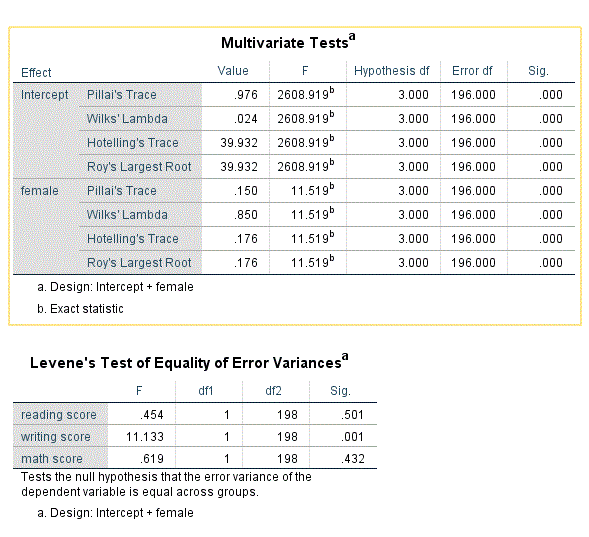

```{r, echo = FALSE, results = "hide"}
include_supplement("Capture2.gif")
include_supplement("Capture3.gif")
include_supplement("Capture4.gif")
include_supplement("Capture5.gif")
include_supplement("Capture2.gif")
include_supplement("Capture3.gif")
include_supplement("Capture4.gif")
include_supplement("Capture5.gif")
```

Question
========
Je gebruikt een MANOVA met de prestaties van scholieren in 3 vakken
("literatuur", "essay writing" en "wiskunde") als afhankelijke
variabelen en "female" (0 = man, 1 = vrouw) als onafhankelijke
variabele. Hieronder vind je de output. Welk paar vrijheidgraden wordt
gebruikt om te beslissen of geslacht een effect heeft op de 3
afhankelijke variabelen samen?  
  




  


Answerlist
----------
* (df) 3, 196
* (df) 3, 198
* (df) 1, 196
* (df) 1, 198

Solution
========


Answerlist
----------
* True
* False
* False
* False

Meta-information
================
exname: vufsw-manova-0290-nl
extype: schoice
exsolution: 1000
exshuffle: TRUE
exsection: inferential statistics/parametric techniques/anova/manova
exextra[Type]: interpretating output
exextra[Program]: NA
exextra[Language]: Dutch
exextra[Level]: statistical reasoning

