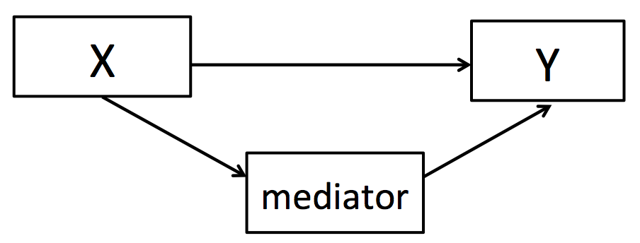

```{r, echo = FALSE, results = "hide"}
include_supplement("Screen__Shot__2020-04-20__at__19.44.12.png", recursive = TRUE)
```

Question
========
Below is the causal model in a mediation analysis schematically shown.  
What is the best description of the **indirect effect** in a mediation analysis?  
  


Answerlist
----------
* The indirect effect is the effect of X on Y that proceeds through the mediator (mediating variable).
* The indirect effect is the effect of X on Y controlled for the effect of mediator (mediating variable) on Y.
* The indirect effect is the effect of mediator (mediating variable) on Y, controlled for the effect of X on Y.
* The indirect effect is the summation of the effect of mediator (mediating variable) on Y and of the effect of X on Y.

Solution
========

concerning I: total 181/620=0.29 , thus 29% total yes.  
For France this would be 0.29*160=46.7.  
Thus 56 (counted) is more than expected .  
Thus I is true  Concerning II: for the Netherlands: 0,29\*150=43,5 to be expected if country and cannabis use is independent.  
Thus 36 is less than expected.  
Thus II is not true.

Language Dutch

Levels of Difficulty Easy

M&T Basics of quantitative research Basics of quantitative research

M&T BIS Default value

M&T Hypothesis testing: proportions Default value
Answerlist
----------
* True
* False
* False
* False

Meta-information
================
exname: vufsw-mediation-0015-en
extype: schoice
exsolution: 1000
exshuffle: TRUE
exsection: inferential statistics/regression/multiple linear regression/mediation
exextra[ID]: 1c506
exextra[Type]: conceptual
exextra[Program]: NA
exextra[Language]: English
exextra[Level]: statistical literacy

