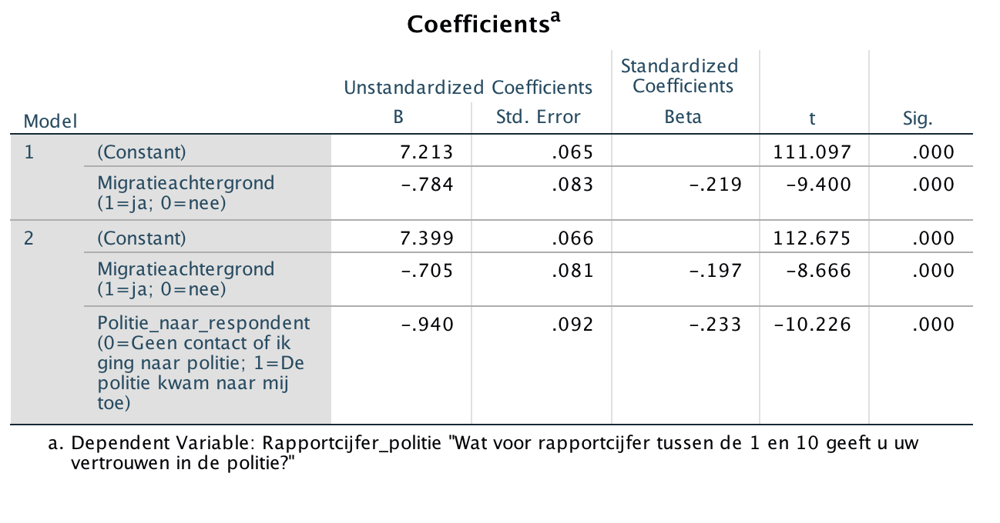

```{r, echo = FALSE, results = "hide"}
include_supplement("Screen__Shot__2020-04-30__at__21.47.15.png", recursive = TRUE)
```

Question
========
The researcher wonders why people from immigrant backgrounds have less trust in the police, compared to people without a migration background. She suspects that the nature of contact with the police may play a mediating role: people with a migration background are more likely to have experienced the police coming to them, leading to less trust in the police.  
  
Below are the results of two regression analyses with the degree of trust in the police (variable: "**Rapportionment of police**") as the dependent variable. Model 1 is a singular model with "**Migration background**" (1 = yes, 0 = no) as the independent variable.  
  
In model 2, the variable "**Politie\_naar\_respondent**"** **toegevoegd. This dummy variable indicates whether a person had contact with the police because the police came to him/her (score = 1) or had no contact or someone went to the police (score = 0).  
  
From what can one conclude that the differences in trust in the police are between people with and without a migration background for a small part can be explained by the fact that the nature of the contact with the police differs between people with and without a migration background?  
  
You can infer that from the fact that ...  
  


Answerlist
----------
* The strength of the effect of "Migration background" in model 2 is slightly decreased compared to model 1: the strength decreases from -0.784 to -0.705.
* The unstandardized effect of "Police response" (-0.940) in model 2 is slightly stronger than the standardized effect of "Politie\_naar\_respondent" (-0,233).
* The value of the constant of model 2 is slightly increased in comparison with model 1: the value increases from 7.213 to 7.399.
* The unstandardized effect of "Migration background" (-0.705) in model 2 is slightly stronger than the standardized effect of "Migration background" (-0.197).

Solution
========

Language Dutch

Levels of Difficulty Easy

M&T Basics of quantitative research Basics of quantitative research

M&T BIS Default value
Answerlist
----------
* True
* False
* False
* False

Meta-information
================
exname: vufsw-mediation-0127-en
extype: schoice
exsolution: 1000
exshuffle: TRUE
exsection: inferential statistics/regression/multiple linear regression/mediation
exextra[ID]: 6c038
exextra[Type]: interpretating output
exextra[Program]: NA
exextra[Language]: English
exextra[Level]: statistical reasoning

