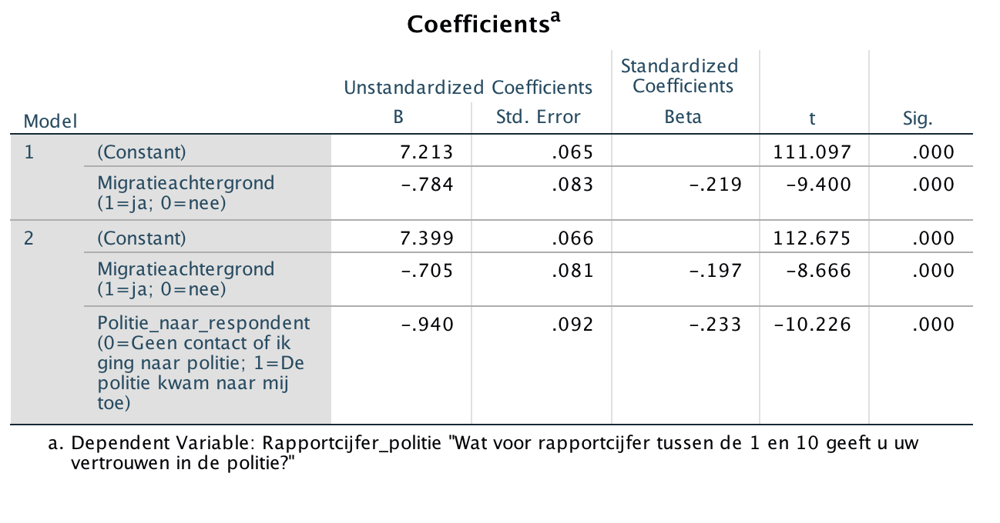

```{r, echo = FALSE, results = "hide"}
include_supplement("Screen__Shot__2020-04-30__at__21.47.15.png")
```

Question
========
De onderzoeker vraagt zich af waarom mensen met een migratieachtergrond
minder vertrouwen hebben in de politie, in vergelijking met mensen
zonder een migratieachtergrond. Zij vermoedt dat de aard van het contact
met de politie een mediërende rol kan spelen: mensen met een
migratieachtergrond zullen vaker meegemaakt hebben dat de politie naar
hen toekwam, hetgeen leidt tot minder vertrouwen in de politie.  
  
Hieronder staan de uitkomsten van twee regressie-analyses met de mate
van vertrouwen in de politie (variabele: "**Rapportcijfer\_politie**")
als afhankelijke variabele. Model 1 is een enkelvoudig model met
"**Migratieachtergrond**" (1 = ja, 0 = nee) als onafhankelijke
variabele.  
  
In model 2 is de variabele
"**Politie\_naar\_respondent**"** **toegevoegd. Deze dummy variabele
geeft aan of iemand contact had met de politie omdat de politie naar
hem/haar toekwam (score = 1) of geen contact had of iemand zelf naar de
politie toeging (score = 0).  
  
Waaruit kun je opmaken dat de verschillen in vertrouwen in de politie
tussen mensen met en zonder een migratieachtergrond voor een klein
gedeelte verklaard kunnen worden door het feit dat de aard van het
contact met de politie verschilt tussen mensen met en zonder een
migratieachtergrond?  
  
Dat kan je opmaken uit het feit dat ...  
  


Answerlist
----------
* de sterkte van het effect van "Migratieachtergrond" in model 2 iets
  afgenomen is in vergelijking met model 1: de sterkte neemt af van -0,784
  naar -0,705.
* het ongestandaardiseerde effect van "Politie\_naar\_respondent" (-0,940)
  in model 2 iets sterker is dan het gestandaardiseerde effect van
  "Politie\_naar\_respondent" (-0,233).
* de waarde van de constante van model 2 iets toegenomen is in
  vergelijking met model 1: de waarde neemt toe van 7,213 naar 7,399.
* het ongestandaardiseerde effect van "Migratieachtergrond" (-0,705) in
  model 2 iets sterker is dan het gestandaardiseerde effect van
  "Migratieachtergrond" (-0,197).

Solution
========


Language  
Nederlands

Levels of Difficulty  
Easy

M&T Basics of quantitative research  
Basics of quantitative research

M&T BIS  
Default value
Answerlist
----------
* True
* False
* False
* False

Meta-information
================
exname: vufsw-mediation-0127-nl
extype: schoice
exsolution: 1000
exshuffle: TRUE
exsection: inferential statistics/regression/multiple linear regression/mediation
exextra[Type]: interpretating output
exextra[Program]: NA
exextra[Language]: dutch
exextra[Level]: statistical reasoning

