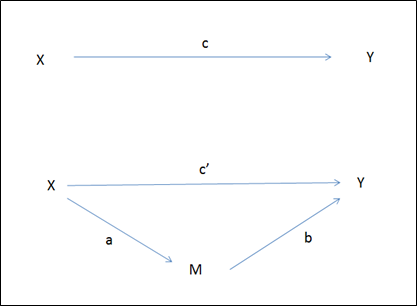

```{r, echo = FALSE, results = "hide"}
include_supplement("1557484725807.png", recursive = TRUE)
```

Question
========
Below, the two steps in a mediation analysis are schematically shown (the intermediate variable is denoted by an M).  
How can we calculate the **indirect effect**?  
  


Answerlist
----------
* A b
* C**'** + b
* C**'** \* b
* C + c**'**

Solution
========

Language Dutch

Levels of Difficulty Easy

M&T Basics of quantitative research Basics of quantitative research

M&T BIS Default value
Answerlist
----------
* True
* False
* False
* False

Meta-information
================
exname: vufsw-mediation-0248-en
extype: schoice
exsolution: 1000
exshuffle: TRUE
exsection: inferential statistics/regression/multiple linear regression/mediation
exextra[ID]: 620e7
exextra[Type]: conceptual
exextra[Program]: NA
exextra[Language]: English
exextra[Level]: statistical literacy

