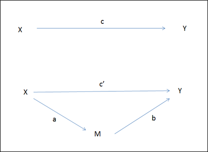

```{r, echo = FALSE, results = "hide"}
include_supplement("1557484725807.png", recursive = TRUE)
```

Question
========
Hieronder zijn de twee stappen bij een mediatie analyse schematisch
weergegeven (de tussenliggende variabele is aangeduid met een M).  
Hoe kunnen we het **indirecte effect** berekenen?  
  


Answerlist
----------
* a \* b
* c**’** + b
* c**’** \* b
* c + c**’**

Solution
========


Language  
Nederlands

Levels of Difficulty  
Easy

M&T Basics of quantitative research  
Basics of quantitative research

M&T BIS  
Default value
Answerlist
----------
* True
* False
* False
* False

Meta-information
================
exname: vufsw-mediation-0248-nl
extype: schoice
exsolution: 1000
exshuffle: TRUE
exsection: inferential statistics/regression/multiple linear regression/mediation
exextra[ID]: 70c74
exextra[Type]: conceptual
exextra[Program]: NA
exextra[Language]: Dutch
exextra[Level]: statistical literacy

