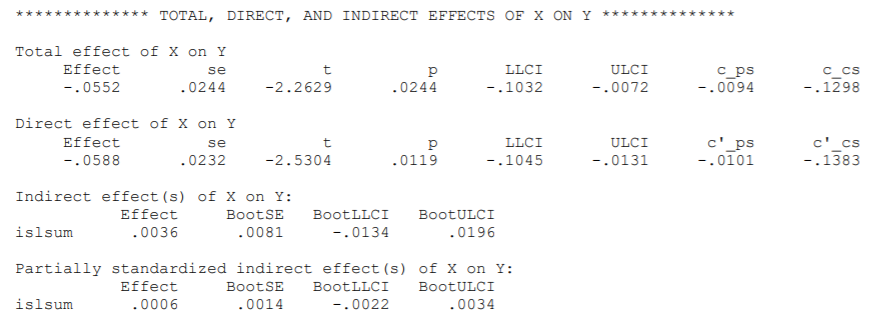

```{r, echo = FALSE, results = "hide"}
include_supplement("1615993706039.png", recursive = TRUE)
```

Question
========
Below is part of the output of a mediation analysis with the Hayes Process.  
With high confidence, we can state that the indirect effect is higher than _______________ **...** and smaller than _______________ **. This means that we have
* ...** have evidence for a mediation effect in the population.  
  


Answerlist
----------
* \[1\] = -0.0134 \[2\] = 0.0196 \"3" = insufficient
* \[1\] = 0.0036 \[2\] = 0.0081 \"3" = adequate
* \[1\] = -0.0134 \[2\] = 0.0036 \"3" = insufficient
* \[1\] = 0.0036 \[2\] = 0.0196 \"3" = adequate
* \[1\] = -0.0134 \[2\] = 0.0081 \"3" = insufficient
* \[1\] = 0.0081 \[2\] = 0.0196 \3" = adequate

Solution
========

This is the bootstrap confidence interval of the indirect effect (-0.0134, 0.0196). The 0 is in the confidence interval. Thus, we have insufficient evidence that a mediation effect exists in the population.

Answerlist
----------
* True
* False
* False
* False
* False
* False

Meta-information
================
exname: vufsw-mediation-0298-en
extype: schoice
exsolution: 100000
exshuffle: TRUE
exsection: inferential statistics/regression/multiple linear regression/mediation
exextra[Type]: interpretating output
exextra[Program]: NA
exextra[Language]: English
exextra[Level]: statistical reasoning

