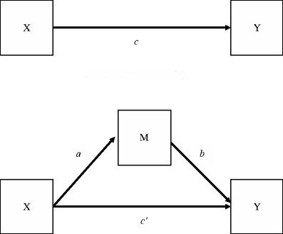

```{r, echo = FALSE, results = "hide"}
include_supplement("mediation.png", recursive = TRUE)
```

Question
========
You examine why task variation at work leads to less stress. One possible explanation is that through task variation learning opportunities increase, thereby reducing stress. Look at the mediation model below.  
  
What does a regression with learning opportunities as the dependent variable and task variation as the independent variable?  
  
  


Answerlist
----------
* *b* and *c'*
* *c*
* *a*
* *b*
* *c'*
* * and *b*
* * and *c'*
* His regression is incorrect.

Solution
========

Answerlist
----------
* False
* False
* True
* False
* False
* False
* False
* False

Meta-information
================
exname: vufsw-mediation-0301-en
extype: schoice
exsolution: 00100000
exshuffle: TRUE
exsection: inferential statistics/regression/multiple linear regression/mediation
exextra[ID]: 6f29b
exextra[Type]: conceptual
exextra[Program]: NA
exextra[Language]: English
exextra[Level]: statistical literacy

