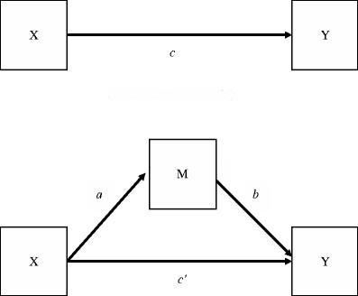

```{r, echo = FALSE, results = "hide"}
include_supplement("mediation.png", recursive = TRUE)
```

Question
========
You examine why task variation at work leads to less stress. One possible explanation is that through task variation learning opportunities increase, thereby reducing stress. Look at the mediation model below.  
  
What does a regression with task variance as the dependent variable and learning opportunities and stress as independent variables?  
  
  


Answerlist
----------
* *b* and *c'*
* *c*
* *a*
* *b*
* *c'*
* * and *b*
* * and *c'*
* His regression is incorrect.

Solution
========

Answerlist
----------
* False
* False
* False
* False
* False
* False
* False
* True

Meta-information
================
exname: vufsw-mediation-0302-en
extype: schoice
exsolution: 00000001
exshuffle: TRUE
exsection: inferential statistics/regression/multiple linear regression/mediation
exextra[ID]: 74a7f
exextra[Type]: conceptual
exextra[Program]: NA
exextra[Language]: English
exextra[Level]: statistical literacy

